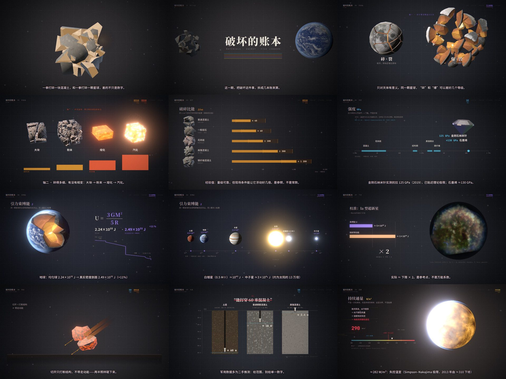

# 破坏的账本 — a real-time explainer on materials and destruction energy

A 7′50″ narrated science explainer in Chinese. It starts from one confusion: "how much energy
does it take to destroy X?" mixes up five quantities that don't convert into each other.
It is a web page, not a video file. Every frame is rendered live with WebGL: fractured
specimens and planets, procedural materials, charts that draw themselves. Each animation step
is cued to the exact word being spoken.



**Open `index.html` and press 开始.** It works straight from disk (`file://`) or from any
static host. All paths are relative and nothing is loaded from the network.

```
destruction-energy-explainer/
├─ index.html          player page (title card, controls)
├─ app.js              engine + 13 scenes, bundled (classic script, works on file://)
├─ preview.jpg
├─ assets/
│  ├─ explainer.mp3    narration + generated score + sound effects (one mixed track)
│  ├─ fonts.js         subset WOFF2 fonts as base64
│  ├─ textures.js      planet textures + Tycho remnant image as base64
│  └─ LICENSES.md
├─ src/                readable source (ES modules); edit here, then `npm run build`
└─ tools/              script, voice, timeline, font, texture and audio pipeline (Python)
```

## The five ledgers

| | Quantity | Unit | What it answers |
| --- | --- | --- | --- |
| 1 | 强度 strength | MPa | at what stress it starts to fail (a threshold, not a price) |
| 2 | 破碎比能 fragmentation energy | J/cc | how much energy breaking it up costs (blasting practice) |
| 3 | 相变能量 phase-change energy | J/cc | melting and vaporising, 2–3 orders of magnitude above breaking |
| 4 | 引力束缚能 gravitational binding energy | J | dispersing a whole celestial body to infinity |
| 5 | 持续通量 sustained flux | W/m² | a power, not an energy; you need the duration |

## Chapters

| Time | Chapter | On screen |
| --- | --- | --- |
| 0:00 | 序 two questions | a concrete block shatters on the word 打碎; Earth slides in; the title is ruled like a ledger |
| 0:19 | 01 five ledgers | five cards with live diagrams; the links between them snap (≠) |
| 1:02 | 02 two axes | verbs 碎/爆/粉碎/湮灭 drop into a matrix; one moon cracks in place, one is blown apart; chunks → powder → melt → vapour; adding up the two bills |
| 1:54 | 03 fragmentation | five 3D specimens break as their values are spoken; the linear chart bends into a log scale and every bar grows a ×⅓…×3 band |
| 2:24 | 04 strength | granite under compression (holds at ~175 MPa) vs tension (snaps); tensile-strength ladder up to the 125 GPa diamond nanoneedle and graphene |
| 3:02 | 05 phase change | an ice cube melts and boils off; basalt glows and evaporates; ×250, and the 2–3 decade gap |
| 3:33 | 06 binding energy | Earth drifts apart and rewinds for U = 3GM²/5R; a wedge opens on the core beside the PREM density profile (+11 %); Mars → neutron star ladder |
| 4:28 | 07 a lower bound | ideal vs real disassembly; a type Ia supernova (Tycho's remnant) as calibration, output ≈ 2 × U; tearing and shaking stay far below U |
| 5:16 | 08 slashing a meteor | the rock is cut along its flight line, both halves keep v and hit anyway; moving ≈ resting rock to cut; only stopping it absorbs ½mv² |
| 5:47 | 09 a number drifts | "60 m of concrete" struck out; three cross-sections at true depth scale |
| 6:18 | 10 two tools | 深不见底: h > b·tan a with a sinking sun; 远处可见: √(2Rh+h²) + √(2RH+H²) |
| 6:47 | 11 flux | 240 W/m² today; past ≈282 W/m² the oceans' vapour runs away; W × s = J |
| 7:20 | 终 | five fields, no shared table, so first ask which quantity |

## Facts checked while writing (corrections to the source notes)

- **Runaway greenhouse:** the limit is ≈282 W/m² (Goldblatt et al., *Nature Geoscience* 2013),
  revised down from ≈310 W/m².
- **GBU-57:** ≈60 m is the USAF figure for unspecified material, usually read as earth.
  ≈18 m is for 5 000 psi reinforced concrete, and ≈2.4 m (8 ft) for 10 000 psi concrete
  (GlobalSecurity.org via Wikipedia). Body mass is ≈12.3 t; "30 000 lb" is the weight class.
- **White dwarf, 0.5 M☉:** ~10⁴³ J, not 10⁴⁴. The ~5×10⁴³ J Ia figure is for a
  near-Chandrasekhar white dwarf.
- **Diamond:** Nie et al., *Nature Communications* 10, 5533 (2019): ~60 nm ⟨100⟩ needles reached
  125 GPa in tension. Graphene's intrinsic strength is ≈130 GPa.
- **Earth's binding energy:** 2.24×10³² J for a uniform sphere, 2.49×10³² J integrated over
  PREM (Wikipedia, "Gravitational binding energy"). The other planets and the Sun use the
  uniform-sphere estimate, which is labelled on screen.
- **Granite tensile strength:** 5–25 MPa. The narration says "一二十兆帕".
- **Fragmentation values** (40 / 60 / ≥100 / ≥300 / ≈1 200 J/cc) are blasting rules of thumb
  and are shown as such. A "40–90×" claim in the notes had no source and was dropped.

## Controls

| Key | Action |
| --- | --- |
| Space | play / pause |
| ← → | seek 5 s |
| 1 – 9 | jump to chapter |
| C | subtitles on/off |
| H | hide the HUD |
| F | fullscreen |

The bottom bar (shown on mouse move) has a scrubber with chapter marks and a render-scale
toggle for slower machines.

## How it works

- **Narration-driven clock.** `tools/script.json` holds each line twice: `say` (spoken) and
  `show` (subtitle). `tools/make_voice.py` voices it with Microsoft Edge neural TTS (Yunyang)
  and records word boundaries. `tools/build_timeline.py` lays the lines out and writes
  `src/data/timeline.js`. In the scenes, `cue('frag', 1, '一千二百焦')` returns the moment that
  word is spoken, so every break, bar and label lands on its word.
- **Rendering.** three.js with custom shaders in a linear HDR pipeline: bloom, filmic shoulder,
  grading, and transitions (ink, blade, iris, shutter, glitch). Diagrams are Canvas2D layers
  composited with sRGB-style blending.
- **Fracture.** Convex Voronoi cells by half-space clipping (`src/gfx/fracture.js`). Fragments
  keep their original object-space position, so procedural materials stay continuous across
  breaks and broken faces can glow. On planets, the broken faces show crust, mantle and core.
- **Materials** (`src/gfx/specimen.js`, `src/gfx/planet.js`): concrete with aggregate and pores,
  rebar sections, steel fibres, granite minerals, basalt vesicles, diamond with three-IOR
  dispersion, a blackbody heat ramp, dissolve-to-vapour, and textured planets with night
  lights, clouds, steam and molten crust for the runaway greenhouse.
- **Audio** (`tools/build_audio.py`): a chord-per-chapter pad score, bell plucks and sound
  effects, all synthesised and placed on the same word cues, ducked under the voice and mixed
  to one MP3.

## Rebuild

```sh
npm install
# voice, timeline (needs edge-tts, ffmpeg; network for TTS)
python3 tools/make_voice.py /tmp/voice && python3 tools/build_timeline.py /tmp/voice
python3 tools/build_audio.py /tmp/voice              # → assets/explainer.mp3
python3 tools/build_fonts.py <dir with the .ttf files> # → assets/fonts.js (subset to used glyphs)
python3 tools/build_textures.py <dir with textures>   # → assets/textures.js
npm run build                                          # → app.js
```

Deterministic frames for checking: `index.html?capture&w=1280&t=<seconds>` renders one frame
and sets `window.__ready`. `window.PV.renderAt(t)` renders any other moment.
