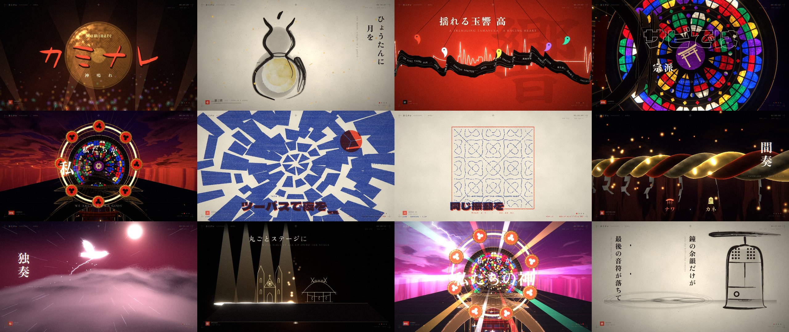

# カミナレ — real-time music video

A three-minute music video for the song **カミナレ** (*kaminare*), rendered live in the
browser. There's no video file: every frame is drawn in real time with WebGL shaders,
procedural sumi ink, stained glass, lightning and kinetic type, all locked to the song.



**Open `index.html` and press 奉納 (play).** It works straight from disk (`file://`) or from
any static host. All paths are relative and nothing loads from the network.

```
kaminare-pv/
├─ index.html          player page (title card, controls)
├─ app.js              the whole engine + scenes, bundled (classic script, works on file://)
├─ assets/
│  ├─ kaminare.m4a     the song (AAC, stream-copied) — mp3 fallback next to it
│  ├─ fonts.js         subset WOFF2 fonts as base64 (Zen Old Mincho, Dela Gothic One, Yuji…)
│  └─ LICENSES.md
├─ src/                readable source (ES modules) — edit here, then `npm run build`
└─ tools/              the offline analysis pipeline (Python)
```

## Controls

| Key | Action |
| --- | --- |
| Space | play / pause |
| ← → | seek 5 s |
| 1 – 9 | jump to section (intro, verse, pre, chorus, verse II, chorus II, solo, bridge, final) |
| F | fullscreen |
| H | hide the HUD |

The bottom bar (appears on mouse move) has a scrubber with chapter marks and a quality
toggle (0.5× / 0.75× / 1× render scale) for slower machines.

## The piece

The title is the hinge: 雷 *kaminari* (thunder) comes from 神鳴り, "the gods resounding".
Raijin is painted with a ring of drums, so here **the drummer's kit, the thunder god's drum
ring and the halo behind a saint are the same object**. The song says every faith is equal
inside a 4/4 bar, so the video gives the cross, torii, dharma wheel, crescent, hexagram,
octagram, taijitu and lotus exactly the same size, light and timing.

| Time | Section | World |
| --- | --- | --- |
| 0:00 | Intro | Darkness, penlights in the five member colours; the lone keyboard melody is written in light (real note onsets & pitches) and collapses into a bronze gong at the gong hit; "This is a Japanese song" is typed as it is spoken |
| 0:11 | Verse I | An *emakimono* handscroll unrolled right-to-left. Four sumi-e paintings brush themselves in: the rosary-wound neck, the bent hymn, a moon in a gourd, the laughing song with a vermilion seal |
| 0:22 | Pre I | Washi dyed vermilion. The bass crawls as an ink serpent carrying prayers in many scripts; magatama swing (玉響) to an ECG heartbeat; five emblems fuse into one sound |
| 0:33 | Chorus | The thunder nave: gothic arches and torii alternate toward a procedural rose window; lightning answers the kick drum; one shot per lyric line (swirl sky, kaleidoscope, blade of light, the slash on 切, Raijin's drum ring as halo) |
| 0:55 | Post | A Swiss-grid poster: four columns = four beats; every symbol ends in one row joined by ＝ |
| 1:05 | Verse II | A two-colour risograph zine (halftone, grain, misregistration on the kicks): octagram drumsticks, twin kicks shattering the night, a lead line that turns into doves, an altar becoming a wall of amps, sutra and strings, Chladni sand finding one vibration |
| 1:23 | Pre II | Indigo. Different names and prayers (Latin, Japanese, Arabic, Sanskrit) meet in one chorus; a bowed crowd raises its heads on the claps; six strings carry every symbol |
| 1:34 | Chorus II | The nave, gilded |
| 1:57 | Interlude | Bass × keys as the two strands of a shimenawa rope, shide fluttering on the beat, lanterns |
| 2:08 | Solo | Soaring over a raymarched, moonlit cloud sea with lightning inside it; a dove of light carries the lead line — then time freezes |
| 2:19 | Bridge | One candle. Keys rise as sparks; a church and a shrine are drawn in gold line and hauled onto a stage whose lights come on beat by beat |
| 2:30 | Final chorus | Key change → the grade turns magenta/white; 4/4 equality sweeps down the aisle; on the last 神 the drum ring fans out in the five member colours and bursts into gold leaf |
| 2:53 | Outro | Back to paper: the last note falls into ink, a temple bell is brushed in, only its echo remains |

## How it's synced

`tools/` holds the offline pipeline that produced `src/data/*.js`:

1. **Demucs** (htdemucs) split vocals from the band.
2. **faster-whisper** (large-v3 / medium) transcribed the vocal stem with word timestamps.
   `align.py` aligned the known lyrics to those timings character by character
   (difflib matching + interpolation), so every glyph appears when it is sung.
3. **librosa** produced a constant beat grid (172.0 BPM, offset 63.8 ms; residual 8 ms),
   kick/snare onsets, 60 fps envelopes (kick, snare, hats, bass, vocal, loudness) and pYIN
   keyboard notes for the intro, bridge and outro.

At runtime the master clock is the `<audio>` element. Every scene is a pure function of
time, so seeking anywhere is exact.

## Rendering

- three.js r186, raw `ShaderMaterial`s everywhere, and a display-referred pipeline:
  transition mixer (blade slash, ink bleed, flash, iris, shutter, glitch) → dual-filter bloom →
  god rays → grade (CA, grain, vignette, hue shift for the key change).
- **Sumi engine** (`src/gfx/ink.js`): bristle bundles that run dry along the stroke (kasure),
  bleed underlayer, spatter. Each plate bakes a colour map *and* a time map, so drawing-on is a
  shader threshold and scrubbing backwards just works.
- **p5.brush** (standalone WebGL2 build) paints the watercolour moon and vermilion washes at load.
- Rose window, storm sky, washi paper, gong, flame, Chladni plate and riso screen are all
  procedural GLSL. The piece loads no image files at all (`preview.jpg` is only for this README).

## Rebuild

```bash
npm install
npm run build          # bundles src/ → app.js
python3 tools/build_fonts.py <dir with the .ttf files>   # re-subset fonts after changing text
```
