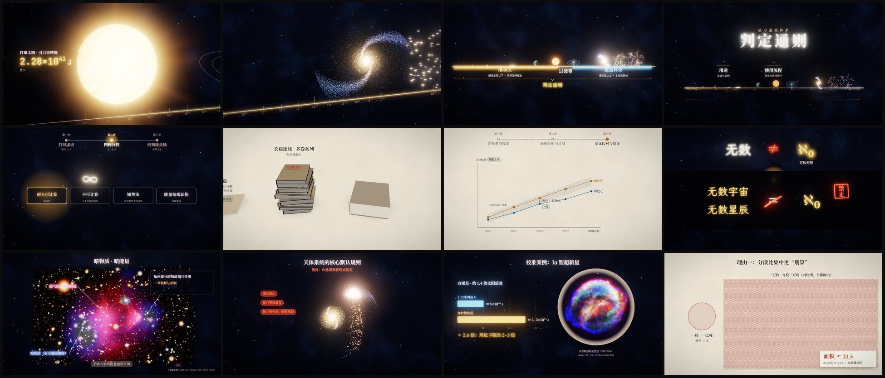

# 判定通则 — a real-time explainer of the power-scale system's ground rules

A 30′57″ narrated explainer in Chinese. It covers everything that comes **before Part 1 (继承区)**
of the 战力量级体系 document:

- the three segments of the system: 继承区, 过渡带, 覆盖体系
- what the system is for: 定级 and 证伪, including the three-step way of pulling a fake "infinite"
  back onto the finite energy axis
- how to use it: scope, batching, the three-step order, the reversed order for very long serials,
  and the carry-over summary
- all sixteen general rules of 第零部分, 0.1–0.16, including 0.2.1, 0.14.1 and 0.15.1

It is a web page, not a video file. Every frame is rendered live in WebGL, and every animation
step is cued to the word being spoken.



**Open `index.html` and press 开始.** It works from disk (`file://`) or from any static host. All
paths are relative and nothing loads from the network.

```
power-scale-general-rules/
├─ index.html          player page (start screen, subtitles, controls)
├─ app.js              engine + 19 chapters, bundled as a classic script
├─ preview.jpg
├─ assets/
│  ├─ soundtrack.mp3   narration + score + effects, one mixed track
│  ├─ fonts.js         subset WOFF2 fonts as base64
│  ├─ images.js        the two reference photographs as base64
│  ├─ src-images/      those photographs as downloaded
│  └─ LICENSES.md
├─ src/                readable source (ES modules); edit here, then `npm run build`
└─ tools/              script, voice, timeline, score, mix, fonts, icons, images, frame capture
```

## Chapters

| Time | Chapter | On screen |
| --- | --- | --- |
| 0:00 | 序 · 一条能量轴 | A camera ride along one energy axis: a mosquito bite, a punch, a brick that shatters, a building, a city, a country, a planet, the Sun (2.28×10⁴¹ J), a star system, a galaxy, a cluster, the cosmic web. The axis is cut into 继承区 / 过渡带 / 覆盖体系, each inherited tier is ticked as recomputed, and the title forms. |
| 1:13 | 01 定级与证伪 | A level balance (two uses of equal weight). Rating worked through: 105 km² → 4.18×10¹⁵ J → 弱爆城. An inflated pin struck off. "无穷无尽" becomes a particle ∞ that is stamped 虚词 (0.2), passed over the four grades of 3.10.3, drained and cracked by energy exhaustion, then pulled back onto the axis. It ends by unrolling into a start line. |
| 2:48 | 02 适用范围与分批 | Engraved 3D books (booklet, a stack of volumes, a setting tome); judgement-point density per page; feeding batches; cutting batches by judgement unit on a chapter ribbon; analysis and calculation in separate rounds inside a working range. |
| 4:04 | 03 执行顺序 | Engraved plane layers; why the setting comes first (a foundation that topples without it); the four outputs; one feat running the five-stage pipeline; a cross-check chart (monotonic growth, win/loss, an outlier, a curve shifted by a wrong reference). |
| 5:40 | 04 超长篇与结转 | A 1,200-chapter strip (dense setting marks, sparse battles); the order reversed; landmark battles first with 假设/存疑 tags; the hand-written carry-over card with 已确认 and 存疑 kept apart. |
| 7:02 | 0.1 | The sixteen rules as an index; highest upper limit; weak/strong versions inside a tier; the reference triangle; real world vs story world (the same mortal hammer blow, a different crack); medians for "几十 / 几百"; no invented numbers; rules resting on four pillars of method. |
| 8:46 | 0.2 | The natural numbers marching to the horizon (ℵ₀); "无数宇宙 = ℵ₀" forbidden; one word, three speakers, three evidence weights; 0.2.1: the motive changes nothing, and jargon falls through a sieve that asks what the text actually does. |
| 11:15 | 0.3–0.5 | A universe-type world vs a small dense one (Σ energy, or plain joules); the Bullet Cluster with its lensing map of dark matter kept out of the sum; a galaxy struck through its core, then a strike that spares it. |
| 12:38 | 0.6 | Energy and range as two readouts; the same energy as a hemisphere or a beam; a big soft glow vs a small dense core; a fight sealed inside a sphere, marked 未观测. |
| 14:22 | 0.7–0.9 | ×N world strength; a hemisphere spreading from a point on a planet, then a controlled fan; a moon removed cell by cell with no shock (Σ only). |
| 15:20 | 0.10 | Attacker, a sun-sized creature and a rock belt: a thin tracking beam that touches nothing vs a spreading front that grinds through the belt; effective diameter d < D, estimated by median. |
| 17:09 | 0.11 | Control as the other face of destruction; the matter × range matrix of cases; 掌控式 vs 砸坑式. |
| 18:18 | 0.12 | A rating card: destructive power is the axis, speed and defence hang beside it as tags. |
| 19:01 | 0.13 | A planet taken apart quietly (exactly U) and explosively (U + heat + light + excess kinetic energy, with an open top); type Ia calibration with Kepler's remnant: U ≈ 5×10⁴³ J vs ejecta ≈ 1.3×10⁴⁴ J. |
| 21:05 | 0.14 | A punch nobody can price; ∞ in a thought bubble vs a huge finite number; result-type vs control-type self-reports; the whole world vs the part actually reached; 0.14.1: an unfinished cut across a star, graded by speaker, written apart from realised feats, crossed with the data criterion. |
| 24:29 | 0.15 | A sealed glass world drained by one cultivator; three explanations; three verdicts; the price tag on ∞. |
| 26:30 | 0.15.1 | The calibration on single blasts; one 100 Mt crater vs 10,000 craters of 10 kt drawn to scale (∛10000 ≈ 21.5× the area); the overheated core; the three rules. |
| 28:39 | 0.16 | Seven special abilities; two axes (reach, hardest material overcome); an engraved knot petrifying from the base; the record format; 0.11 and 0.16 side by side. |
| 30:28 | 终 | The sixteen rules settle under the axis; the next part is named. |

## Facts checked while writing

- **Type Ia supernova (0.13).** A near-Chandrasekhar C/O white dwarf has a gravitational binding
  energy of about 5×10⁵⁰ erg (5×10⁴³ J). About 1.9×10⁵¹ erg is released by burning, and the ejecta
  carry about 1.3×10⁵¹ erg (1.3×10⁴⁴ J), roughly 2.6 × the binding energy. This matches the
  document's "2–3 ×".
- **Scattered vs concentrated blasts (0.15.1).** The radius for a given overpressure scales with the
  cube root of yield, so the area scales as yield^⅔. Splitting a yield into N non-overlapping parts
  multiplies the area by ∛N, so 10,000 × 10 kt against 1 × 100 Mt gives ∛10000 ≈ 21.5. The film
  states the non-overlap condition. This is the physical reason behind the document's
  "分散比集中更划算".
- **Kepler's supernova remnant (SN 1604)** is the Type Ia remnant used for the photograph.
- Values marked 示意 or 示例 on screen (for example the joule readouts in 0.3 and 0.6, and the
  landmark battle cards in chapter 04) are illustrations of a format, not data from the document.

## Controls

| Key | Action |
| --- | --- |
| Space | play / pause |
| ← → | seek 5 s |
| 1 – 9 | jump to chapter |
| C | subtitles on/off |
| F | fullscreen |
| H | hide the control bar |

The control bar (shown on mouse move) has a scrubber with chapter marks and a render-quality
toggle (高 / 中 / 低) for slower machines.

## How it works

- **Narration-driven clock.** `tools/script.json` holds every line twice: `say` (spoken) and
  `show` (subtitle). `tools/make_voice.py` voices it with Microsoft Edge neural TTS (Yunyang) and
  records word boundaries. `tools/build_timeline.py` lays the lines on one clock and writes
  `src/data/timeline.js`. In a chapter, `c(7, '摧毁')` returns the moment that word is spoken.
- **Two registers, one colour code.** The night register (observatory) and the paper register
  (case file, ivory paper with ink) share one semantic palette: amber for energy, azure for range,
  vermilion for rejected, ochre for doubtful, jade for confirmed.
- **Rendering** (`src/core/stage.js`). Each chapter renders its three.js scene into an HDR target.
  Its 2D overlay (a 1920×1080 virtual canvas) is composited on top. Chapters cross over through an
  ink-bleed mask, then bloom is applied, and grading is filmic at night and near-linear on paper.
  The composite carries "paper-ness" in its alpha so grading can switch per pixel mid-transition.
- **Shaders** (`src/gfx`): copper-plate engraving (form-following contour bands, screen-space
  cross-hatching, stipple, ink rim, a bite-in reveal) for books, plane layers and the petrifying
  knot; a granulated stellar surface with limb darkening; a procedural planet with clouds, ocean
  glint, night lights and atmosphere; Fresnel shock shells; particle systems for the ∞, galaxies
  (with a burn region for strikes), the cosmic web and planetary debris; a star-field backdrop and
  an ivory paper backdrop with fibres.
- **2D toolkit** (`src/core/draw2d.js`): word-by-word text reveal, raised exponents, tapered ink
  brush strokes with dry streaks, worn seal stamps, cards with nested fades, and Tabler icons that
  draw themselves.
- **Score** (`tools/compose.py`). Three cues are written as code and rendered with the
  [XSXB-Band](https://github.com/sparklecatta-lang/XSXB-Band) studio from real CC0 instrument
  recordings: axis (cello, strings, harp, tubular bells, timpani, flute), night (tremolo strings,
  harp, flute, vibraphone) and ledger (piano, pizzicato, vibraphone, strings).
  `tools/build_audio.py` loops each cue on a global grid and crossfades at chapter changes. It
  ducks the score under the voice and adds a few synthesised effects on word cues (chapter
  whooshes and chimes, the brick, the Sun, the strikes, the explosions). A two-pass linear
  loudnorm brings the mix to −16 LUFS.

## Rebuild

```sh
npm install
python3 tools/make_voice.py /tmp/voice && python3 tools/build_timeline.py /tmp/voice   # needs edge-tts, ffmpeg, network
python3 tools/compose.py /tmp/music
# render each cue with XSXB-Band (studio running at 127.0.0.1:4318):
#   node <XSXB-Band>/skills/xsxb-band/scripts/render.mjs --project /tmp/music/pv-axis.json --out /tmp/music/out-axis   (same for night, ledger)
python3 tools/build_audio.py /tmp/voice /tmp/music       # → assets/soundtrack.mp3
python3 tools/build_icons.py                             # → src/data/icons.js
python3 tools/build_fonts.py <dir with the .ttf files>   # → assets/fonts.js (subset to the glyphs used)
python3 tools/build_images.py                            # → assets/images.js
npm run build                                            # → app.js
```

Frames for checking: `node tools/frames.mjs <outdir> 1280 23 131 scene:r13:6` renders chosen
moments with headless Chromium. `index.html?capture&w=1280&t=<seconds>` renders one frame and
sets `window.__ready`; `window.PV.renderAt(t)` renders any other moment.
